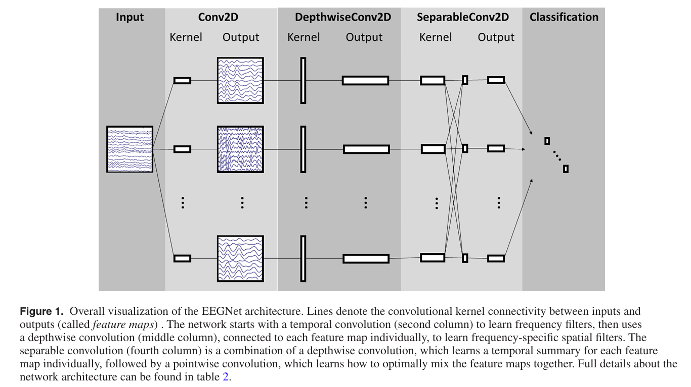
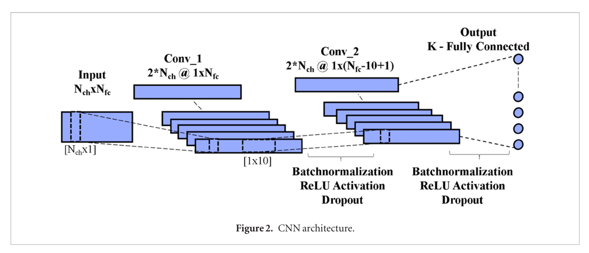
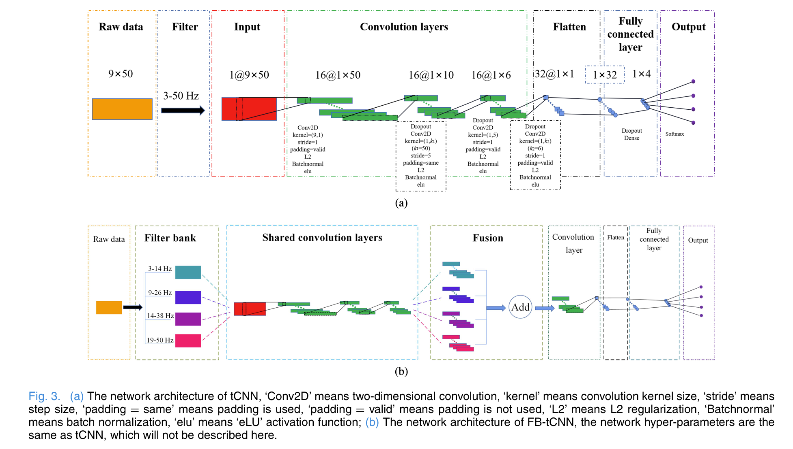
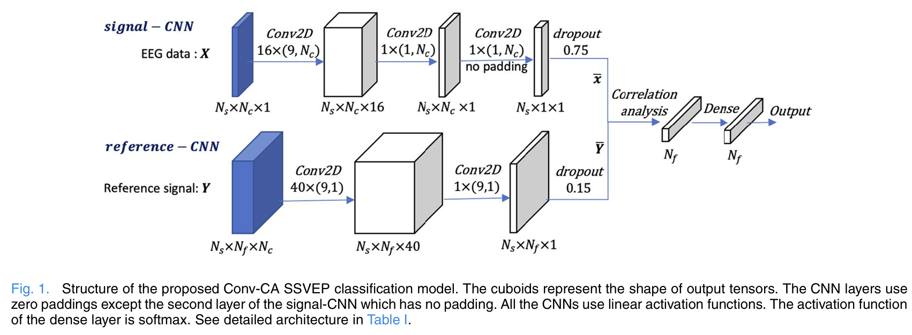

# Aim & Scope
Steady state visual evoked potential(SSVEP) refers to the electrophysiological signals related to stimulus frequency that are evoked in the occipital-frontal lobe region of the brain when the subject continuously fixates on flashing or flipping stimuli at a fixed frequency. Compared to P300, motor imagery (MI) and other EEG signals, SSVEP has a higher signal-to-noise ratio and can produce higher ITR, making it one of the most promising EEG paradigms for a long time. However, traditional signal processing algorithms rely on manual feature extraction in decoding SSVEP signals, and have poor performance in various extreme situations (short data length, large number of stimuli, and small number of calibration data), which cannot meet the practical needs of the industry. Deep learning technology, one of the main branches of artificial intelligence, has been used in research in various fields such as computer vision, natural language processing, recommendation systems, etc. Due to its powerful feature expression ability and extremely high flexibility, it has overturned the algorithm design ideas in these fields and achieved remarkable results. 

In recent years, deep learning technology has gradually been favored by researchers in the field of BCI. This repository is provided for replicating the deep learning-based recognition methods of SSVEP signals. The replicated methods include EEGNet [1]-[2], C-CNN [3], FBtCNN [4], ConvCA [5], SSVEPNet [6], and SSVEPformer [7]. The file distribution follow the code desgin of <a href="https://github.com/YuDongPan/SSVEPNet">SSVEPNet</a>, and a 12-class public dataset [6] was used to conduct evaluation.

# Model Introduction
- EEGNet: EEGNet is a convolutional neural network model specifically designed for processing EEG signal data, which receives time-domain EEG data as network input. EEGNet consists of 4 layers. The first layer is a convolutional layer that simulates bandpass filtering for each channel. The second layer is a spatial filtering layer that weights the data from each channel, achieved through depth-wise convolution. The third layer is a separate convolutional layer for extracting category information. The fourth layer is a fully connected layer for classification. Since its proposal, EEGNet has been used in various EEG tasks, such as motor imagery, P300, SSVEP, etc [1]-[2].
  

- CCNN: CCNN is also a convolutional neural network model. Differently, C-CNN uses frequency domain data rich in amplitude and phase information as network inputs. It is worth noting that in order to obtain the input of the network, CCNN uses a padding based FFT algorithm, which can obtain 220 data points at any data length, including 110 real part data and 110 imaginary part data. The CCNN network structure consists of two convolutional layers and a fully connected layer. The first convolutional layer is a spatial filtering layer, the second convolutional layer is a temporal filtering layer, and the fully connected layer is used for classification. The emergence of CCNN indicates that spectral data is beneficial for SSVEP classification [3].

- FBtCNN: Under the paradigm of frequency domain input, the features under short-term windows may not be obvious and the temporal differences of each channel may be ignored. Considering that there is a lot of effective information about frequency identification embedded in harmonic information, researchers have proposed a CNN architecture based on filter bank technology, termed as FBtCNN. FBtCNN uses time-domain signals as network inputs and uses filter banks to fuse feature information from different frequency bands to improve the classification performance of the network [4].

  
- ConvCA: The SSVEP signals collected from different electrode channels have a non-linear relationship with each other, and linear combination of EEG signals from multiple channels may not be the most accurate solution to classify SSVEPs. In order to further improve the performance of SSVEP-BCI, researchers have proposed a CNN based non-linear correlation analysis network , termed as ConvCA. ConvCA has two branches, one is a signal network that degrades multi-channel EEG signals into single-channel EEG signals, and the other is a reference network that interprets multi-channel reference signals into single-channel reference signals. ConvCA completes the classification process of SSVEP by analyzing the correlation between the signal network output and the reference network output.

  
- SSVEPNet: SSVEPNet is a hybrid network model of convolutional neural networks and long short-term memory networks, which accepts time-domain data as network input. SSVEPNet consists of three parts: convolutional neural network, long short-term memory network, and fully connected network. Among them, CNN is used to extract spatio-temporal features of EEG, a bidirectional LSTM is used for encoding based on the dependencies between spatio-temporal features, and a fully connected network consisting of three fully connected layers is used for final classification. In addition, in order to suppress possible overfitting during network training, spectral normalization and label based smoothing techniques were combined in the network implementation process to further improve the generalization of the model. SSVEPNet can still achieve very good classification performance even with only a small amount of calibration data, and this feature has been validated on 4-class, 12 class, and 40 class datasets.

- SSVEPformer: The Transformer based on attention mechanism has been applied in multiple fields such as CV and NLP, and has achieved remarkable results that have attracted worldwide attention. In recent years, Transformers have gradually been introduced into the decoding and analysis of EEG signals, revealing the potential application of Transformers in SSVEP-BCI systems. Due to the current dependence of SSVEP decoding algorithms on a large amount of subject calibration data, researchers have proposed the SSVEP classification network SSVEPformer based on Transformer to achieve zero calibration high-performance networks. The network inputs of SSVEPformer and C-CNN are consistent, using frequency domain signals as inputs, and combining CNN and MLP networks to complete the feature encoding and attention learning process of Transformer. SSVEPformer can achieve significant classification performance in cross-subject experiments, significantly outperforming other classification networks. In addition, combining filter bank technology, researchers have proposed an improved version of the network FB-SSVEPformer to further enhance network performance.

# Reference
[1] Lawhern V J, Solon A J, Waytowich N R, et al. EEGNet: a compact convolutional neural network for EEG-based brain–computer interfaces[J]. Journal of neural engineering, 2018, 15(5): 056013. <a href="https://iopscience.iop.org/article/10.1088/1741-2552/aace8c/meta">https://iopscience.iop.org/article/10.1088/1741-2552/aace8c/meta</a>

[2] Waytowich N, Lawhern V J, Garcia J O, et al. Compact convolutional neural networks for classification of asynchronous steady-state visual evoked potentials[J]. Journal of neural engineering, 2018, 15(6): 066031. <a href="https://iopscience.iop.org/article/10.1088/1741-2552/aae5d8/meta">https://iopscience.iop.org/article/10.1088/1741-2552/aae5d8/meta</a>

[3] Ravi A, Beni N H, Manuel J, et al. Comparing user-dependent and user-independent training of CNN for SSVEP BCI[J]. Journal of neural engineering, 2020, 17(2): 026028. <a href="https://iopscience.iop.org/article/10.1088/1741-2552/ab6a67/meta">https://iopscience.iop.org/article/10.1088/1741-2552/ab6a67/meta</a>

[4] Ding W, Shan J, Fang B, et al. Filter bank convolutional neural network for short time-window steady-state visual evoked potential classification[J]. IEEE Transactions on Neural Systems and Rehabilitation Engineering, 2021, 29: 2615-2624. <a href="https://ieeexplore.ieee.org/abstract/document/9632600/">https://ieeexplore.ieee.org/abstract/document/9632600/</a>

[5] Li Y, Xiang J, Kesavadas T. Convolutional correlation analysis for enhancing the performance of SSVEP-based brain-computer interface[J]. IEEE Transactions on Neural Systems and Rehabilitation Engineering, 2020, 28(12): 2681-2690. <a href="https://ieeexplore.ieee.org/abstract/document/9261605/">https://ieeexplore.ieee.org/abstract/document/9261605/</a>

[6] Pan Y, Chen J, Zhang Y, et al. An efficient CNN-LSTM network with spectral normalization and label smoothing technologies for SSVEP frequency recognition[J]. Journal of Neural Engineering, 2022, 19(5): 056014. <a href="https://iopscience.iop.org/article/10.1088/1741-2552/ac8dc5/meta">https://iopscience.iop.org/article/10.1088/1741-2552/ac8dc5/meta</a>

[7] Chen J, Zhang Y, Pan Y, et al. A Transformer-based deep neural network model for SSVEP classification[J]. Neural Networks, 2023, 164: 521-534. <a href="https://www.sciencedirect.com/science/article/abs/pii/S0893608023002319">https://www.sciencedirect.com/science/article/abs/pii/S0893608023002319</a>

